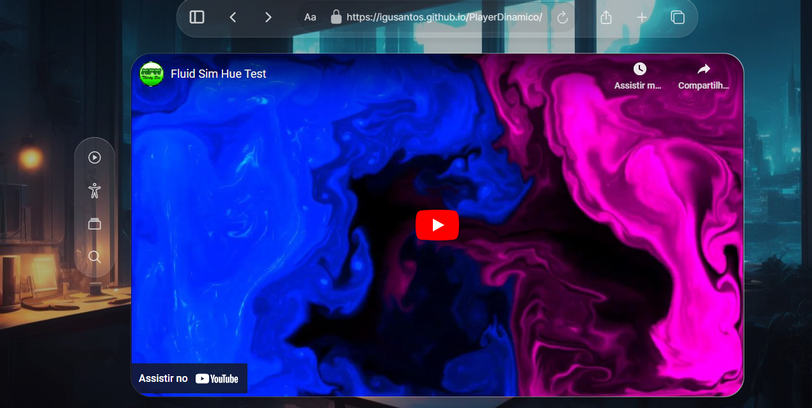

<h1 align="center">Player Dinâmico </h1>

O projeto requer uma integração entre o reprodutor de vídeo e uma biblioteca ou API de processamento de imagem, possibilitando a extração e análise das cores do vídeo em tempo real.  

  <a href="#-tecnologias">Tecnologias</a>&nbsp;&nbsp;&nbsp;|&nbsp;&nbsp;&nbsp;
  <a href="#-layout">Layout</a>&nbsp;&nbsp;&nbsp;|&nbsp;&nbsp;&nbsp;
  <a href="#memo-licença">Licença</a>

  

 

  

## :rocket: Tecnologias

Esse projeto foi desenvolvido com as seguintes tecnologias:

- HTML, CSS e JS)
- Git, Github (actions, pages)
- Figma

## :bookmark: Layout

Você pode visualizar o layout do projeto através [DESSE LINK](https://www.figma.com/file/kGxUzzaGHjrtW2JaTTlagh/Player-de-VR-%E2%80%A2-Desafio-25-(Community)?type=design&node-id=3-376&mode=design&t=u2bxXZVSDedpxuaT-0). É necessário ter conta no [Figma](https://figma.com) para acessá-lo.
